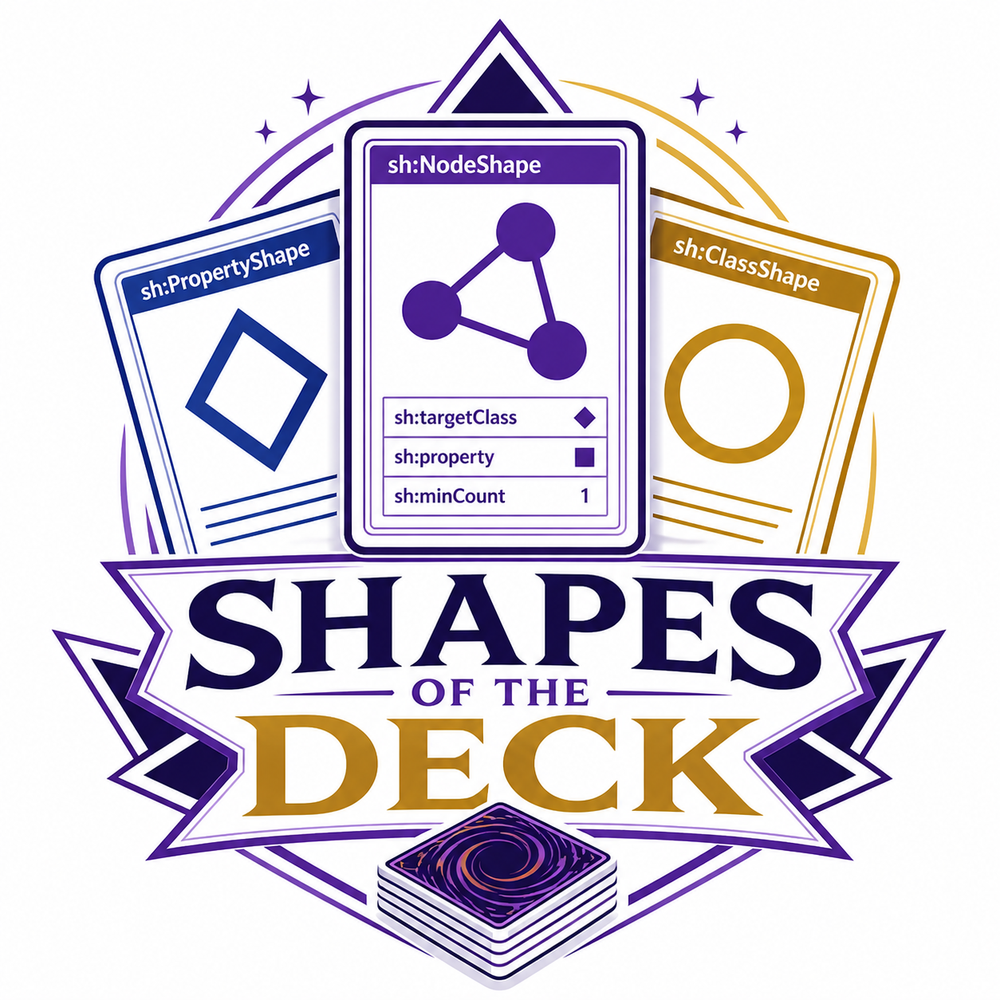
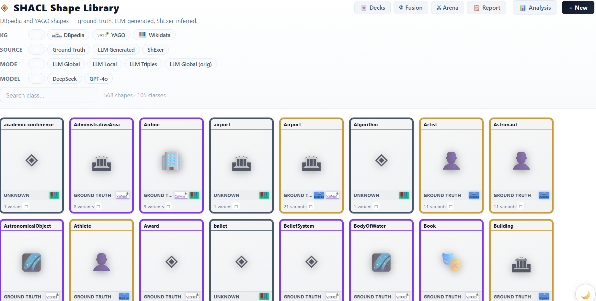

# ShapeOfTheDecks - Beta Version

[](https://creativecommons.org/licenses/by-nc-nd/4.0/)
[]()
[](https://github.com/datalogism/SHACLEditor)
[](https://nodejs.org/)
[](https://react.dev/)
[](https://vitejs.dev/)
[](https://www.python.org/)
[]()
[](https://github.com/datalogism/DoubleShapespresso)
[](https://www.w3.org/TR/shacl/)



> **⚠️ Beta** — ShapeOfTheDecks is currently in active development. Expect breaking changes between releases.

**ShapeOfTheDecks** is a local, browser-based workbench for working with **SHACL shapes** extracted from knowledge graphs. It provides a complete workflow from exploring a curated shape library to building, fusing, annotating, and evaluating shapes — all without any cloud dependency.



---

## Modules

ShapeOfTheDecks is organised around six integrated modules, all accessible from the main navigation bar.

### 📚 Shape Library

The entry point of the application. Browse **606 pre-built SHACL shapes** across four sources — Ground Truth, LLM-generated (DeepSeek-V3, GPT-4o-mini), ShExer, and Kastor — covering DBpedia, YAGO, and Wikidata.

> The shapes bundled in this library originate from the [DoubleShapespresso](https://github.com/datalogism/DoubleShapespresso) project.

- Filter by knowledge graph, generation source, mode, and model.
- Compare all variants of a class side-by-side (property counts, constraint types).
- Load or clone any shape directly into the Shape Builder.
- Save filtered selections as a new Deck with one click.

### 🃏 Shape Deck Builder

Organise shapes into **named decks** — curated collections of shape slots used for comparative analysis. A deck defines a matrix of classes × generation methods, making it easy to track coverage and quality across approaches.


- Browse built-in decks (e.g., *DoubleShapresso*: GT vs DeepSeek vs ShExer on DBpedia & YAGO).
- Create custom decks by picking slots from the library filters or by hand-selecting individual shapes.
- Decks are stored locally in `localStorage` and persist across sessions.
- Open any cell in the deck matrix to load that specific shape into the editor.

### ⚗️ Shape Fusion

Merge two shapes into one using three **fusion strategies**:

| Strategy | Behaviour |
|----------|-----------|
| **Union** | All properties from A and B (B wins on conflict) |
| **Intersection** | Only properties present in both A and B |
| **A-Priority** | A wins on conflict; unique B properties are appended |

- Color-coded property diff before fusing: **red** = A only, **blue** = B only, **purple** = shared.
- Source-model badges on the shape picker (GT, DeepSeek, GPT-4o-mini, Kastor) for easy identification.
- Search shapes by class name, model, or KG.
- Fused result opens directly in the **Shape Builder** in a new browser tab.

### ⬡ Namespace Manager

A cross-library analytics view that scans all 606 shapes and builds an index of every **property namespace** used.

- Table of all prefixes (e.g., `dbo:`, `schema:`, `yago:`, `foaf:`) with their full URIs, distinct property count, and shape coverage.
- Expandable rows reveal which shapes use each namespace and which specific paths.
- Sort by most props, most shapes, or alphabetically.
- Live search across namespace prefixes.

### ◉ Shape Topic Designer

A cross-library analytics view indexed by **semantic topic annotations** embedded in shape files as section-header comments (`# ═══ TOPIC NAME ═══`).

- Global statistics: total topics, annotated properties, shapes with topics, and library coverage percentage.
- Expandable rows show each shape's contribution to a topic and the exact property paths.
- Sort by most shapes, most distinct props, or alphabetically.
- Only Ground Truth shapes carry full topic annotations; the designer makes their structure visible and reusable.

### ◈ Shape Builder

The core visual editor for creating and modifying shapes. Supports three views of the same shape:

**Graph view**
- **UML mode** — properties as rows inside a class table node; the standard layout for structural inspection.
- **VOWL mode** — properties as coloured hexagon nodes radiating from the shape centre; better for exploring connectivity.
- Topic/namespace filter panel to isolate property groups.
- Drag-and-drop layout with Dagre auto-layout.

**List view**
- Structured table grouped by topic sections.
- Inline constraint display: path, nodeKind, datatype, maxCount, semantic badges.
- Bulk topic assignment via multi-select and sticky Bulk Bar.

**Code view**
- Live Turtle editor with full read/write access.
- Apply edits to update the graph model in real time.
- Edit history for reviewing changes.

**Shared editor features**
- Undo / Redo (Ctrl+Z / Ctrl+Y, up to 50 steps).
- Add NodeShapes, PropertyShapes, and logic operator nodes (`sh:and`, `sh:or`, `sh:not`, `sh:xone`).
- `💾 .ttl` — download the current shape as a Turtle file.
- `📚 Library` — save the shape back into the local library (dev server only).
- `→ ShEx` / `← ShEx` — export/import via the optional ShEx translator server.
- Prefix and ontology configuration panel.

---

## Documentation

| Resource | Description |
|----------|-------------|
| [tutorial/TUTORIAL.md](tutorial/TUTORIAL.md) | **Complete user tutorial** with annotated screenshots of every module |
| [docs/README.md](docs/README.md) | **Technical documentation index** — architecture, data formats, development guide |

---

## Requirements

### Core application (required)

| Dependency | Minimum version | Notes |
|------------|----------------|-------|
| **Node.js** | **18.x** | 20 LTS or 22 LTS recommended |
| **npm** | **9.x** | Bundled with Node.js |

The application runs entirely in the browser. No database or remote service is required.

### ShEx translator server (optional)

Enables the `→ ShEx` and `← ShEx` format-conversion buttons in the Shape Builder toolbar. All other features work without it.

| Dependency | Minimum version |
|------------|----------------|
| **Python** | **3.10+** |
| **fastapi** | latest stable |
| **uvicorn** | latest stable |
| **shaclex-py** | latest stable |

---

## Running locally

### Step 1 — Get the code

```bash
git clone <repository-url>
cd SHACLEditor
```

### Step 2 — Install dependencies

```bash
cd shacl-editor
npm install
```

### Step 3 — Start the application

```bash
npm run dev
```

Vite will print:

```
  VITE vX.Y.Z  ready in NNN ms

  ➜  Local:   http://localhost:5173/
  ➜  Network: use --host to expose
```

Open **[http://localhost:5173](http://localhost:5173)** in any modern browser.  
The app opens on the **Shape Library**.

> If port 5173 is busy, Vite automatically tries 5174, 5175, etc.

### Step 4 — (Optional) Start the ShEx translator

In a **second terminal**, from the project root:

```bash
pip install fastapi uvicorn shaclex-py
python shacl-editor/translator_server.py
```

The translator server starts on `http://localhost:8765`. A **green dot** appears next to the ShEx buttons in the Shape Builder toolbar when it is reachable. A red dot means it is not running — the buttons are disabled but the rest of the app is unaffected.

---

## Project structure

```
SHACLEditor/
├── README.md                      ← you are here
│
├── shacl-editor/                  ← Vite + React application
│   ├── public/
│   │   ├── shapes/                ← 606 Turtle shape files
│   │   │   ├── index.json         ← flat index of all shapes
│   │   │   ├── ground-truth/      ← 169 hand-crafted reference shapes
│   │   │   ├── shapes_generated/  ← 342 LLM-generated shapes
│   │   │   ├── shexer/            ← 57 ShExer-extracted shapes
│   │   │   └── kastor/            ← 38 Kastor/txt2kg shapes
│   │   ├── decks/                 ← built-in deck definitions (JSON)
│   │   ├── eval/                  ← evaluation run results
│   │   └── img/                   ← KG logos (dbpedia, yago, wikidata)
│   │
│   ├── src/
│   │   ├── App.jsx                ← root component + navigation state
│   │   ├── App.css                ← all styles (~4 500 lines)
│   │   ├── components/
│   │   │   ├── ShapeLibrary.jsx   ← Shape Library module
│   │   │   ├── DeckView.jsx       ← Shape Deck Builder module
│   │   │   ├── ShapeFusion.jsx    ← Shape Fusion module
│   │   │   ├── NamespaceStudio.jsx← Namespace Manager module
│   │   │   ├── TopicStudio.jsx    ← Shape Topic Designer module
│   │   │   ├── ShapeListView.jsx  ← Shape Builder — list view
│   │   │   ├── CodeEditorView.jsx ← Shape Builder — code view
│   │   │   ├── ShapeArena.jsx     ← Shape Arena (evaluation leaderboard)
│   │   │   ├── ShapeReport.jsx    ← Shape Report (validation viewer)
│   │   │   ├── ConstraintPanel.jsx
│   │   │   ├── ConfigPanel.jsx
│   │   │   └── nodes/  edges/     ← ReactFlow custom node/edge components
│   │   └── utils/
│   │       ├── turtleImport.js    ← Turtle → ReactFlow graph model
│   │       ├── turtleExport.js    ← ReactFlow graph model → Turtle
│   │       ├── graphLayout.js     ← Dagre auto-layout
│   │       ├── translator.js      ← SHACL ↔ ShEx API calls
│   │       ├── topicColors.js     ← deterministic colour per topic
│   │       └── turtleImport.js    ← topic map extraction
│   │
│   ├── translator_server.py       ← optional FastAPI ShEx translator
│   └── vite.config.js             ← Vite config + save-shape middleware
│
├── shapes/                        ← source shape files (mirrored to public/)
├── docs/                          ← technical documentation
│   ├── README.md                  ← documentation index
│   ├── architecture.md
│   ├── data-formats.md
│   ├── development.md
│   ├── shape-library.md
│   └── shape-of-the-deck.md
└── tutorial/                      ← user tutorial + screenshots
    └── TUTORIAL.md
```

---

## Shape library at a glance

All shapes originate from the [DoubleShapespresso](https://github.com/datalogism/DoubleShapespresso) project.

| Source | Shapes | Description |
|--------|-------:|-------------|
| `ground-truth` | 169 | Hand-crafted, topic-annotated reference shapes |
| `shapes_generated` | 342 | LLM-generated (DeepSeek-V3, GPT-4o-mini, global/local/triples modes) |
| `shexer` | 57 | Extracted by the ShExer statistical tool |
| `kastor` | 38 | Generated by the Kastor / txt2kg pipeline |
| **Total** | **606** | DBpedia · YAGO · Wikidata |

---

## Tech stack

| Layer | Library / version |
|-------|------------------|
| UI framework | React 19 + Vite 8 |
| Graph canvas | @xyflow/react v12 (ReactFlow) |
| Graph layout | @dagrejs/dagre |
| Turtle parsing & serialisation | n3.js v2 |
| Code editor | @uiw/react-codemirror (CodeMirror 6) |
| Styling | Plain CSS (no framework) |
| Shape persistence | `localStorage` (user decks + user shapes) |
| Optional translator | FastAPI + shaclex-py (Python 3.10+) |

---

## Building for production

```bash
cd shacl-editor
npm run build       # output → shacl-editor/dist/
```

`dist/` is a standard static SPA. Deploy it to any static host or CDN. All shape files are copied verbatim from `public/`.

> **Note:** The save-to-library feature (`📚 Library` button) requires the Vite dev-server middleware and is not available in the production build.

---

## Adding your own shapes

1. Place your `.ttl` file under `shacl-editor/public/shapes/` (any subdirectory).
2. Add an entry to `shacl-editor/public/shapes/index.json`:

```json
{
  "path":     "user/MyClassShape.ttl",
  "source":   "user",
  "kg":       "dbpedia",
  "gen_mode": "manual",
  "model":    "",
  "variant":  "user",
  "class":    "MyClass"
}
```

3. Reload the app — the shape appears in the library immediately.

Alternatively, use the **📚 Library** button in the Shape Builder toolbar to save the currently open shape directly to `public/shapes/user/` (dev server only — uses the Vite save-shape middleware).

---

## Known limitations (Beta)

- The `📚 Library` save button works in development mode only (`npm run dev`).
- The ShEx translator requires a separate Python process and `shaclex-py` to be installed.
- No authentication — all data is local to the browser and the local filesystem.
- Topic annotations (`# ═══ SECTION ═══`) are only present in Ground Truth shapes; LLM-generated shapes fall back to namespace-based grouping.
- The Shape Builder does not yet support `sh:sparql` or `sh:closed` visually (they are preserved in the Turtle round-trip).

---

---

## License

Copyright © 2026 ShapeOfTheDecks Authors.

This project is licensed under the **Creative Commons Attribution-NonCommercial-NoDerivatives 4.0 International** license ([CC BY-NC-ND 4.0](https://creativecommons.org/licenses/by-nc-nd/4.0/)).

You may view and share the material with attribution, but you may **not**:
- Use it for **commercial purposes**
- Create and distribute **derivative works or adaptations**

See the [LICENSE](LICENSE) file for the full terms.

---

*ShapeOfTheDecks — Beta · [User Tutorial](tutorial/TUTORIAL.md) · [Technical Docs](docs/README.md)*
