# Shapespresso — Complete User Tutorial

> **Shapespresso** is a visual environment for browsing, editing, comparing, and fusing SHACL shapes extracted from knowledge graphs (DBpedia, YAGO, Wikidata). It combines a curated shape library, a graph/list/code editor, analytic studios, an evaluation arena, and a validation report viewer — all in one browser application.

---

## Table of Contents

1. [Shape Library](#1-shape-library)
   - 1.1 [Browsing and filtering shapes](#11-browsing-and-filtering-shapes)
   - 1.2 [Shape detail panel](#12-shape-detail-panel)
   - 1.3 [Decks — curated shape collections](#13-decks--curated-shape-collections)
2. [Shape Editor — Graph View](#2-shape-editor--graph-view)
   - 2.1 [UML and VOWL rendering modes](#21-uml-and-vowl-rendering-modes)
   - 2.2 [Topic and namespace filters](#22-topic-and-namespace-filters)
3. [Shape Editor — List and Code Views](#3-shape-editor--list-and-code-views)
   - 3.1 [List view](#31-list-view)
   - 3.2 [Code view](#32-code-view)
4. [Topic Studio](#4-topic-studio)
5. [Namespace Studio](#5-namespace-studio)
6. [Shape Arena](#6-shape-arena)
7. [Shape Report](#7-shape-report)
8. [Configuration](#8-configuration)

---

## 1. Shape Library

The **Shape Library** is the home screen. It is the starting point for every workflow — loading a shape into the editor, comparing variants, or launching an analytic studio.

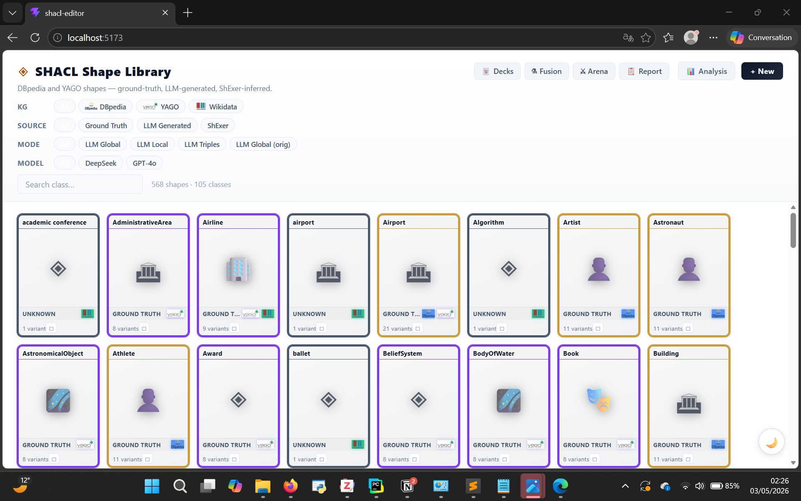

### 1.1 Browsing and filtering shapes

The library displays shape cards arranged in an alphabetical grid. Each card represents one class (e.g., *Airport*, *Artist*, *Astronaut*) and may have several variants generated by different methods.

**Filter bar** — four filter rows narrow the visible cards:

| Filter | Options |
|--------|---------|
| **KG** | DBpedia · YAGO · Wikidata |
| **Source** | Ground Truth · LLM Generated · ShExer · Kastor |
| **Mode** | LLM Global · LLM Local · LLM Triples · LLM Global (only) |
| **Model** | DeepSeek · GPT-4o |

**Search box** — type any class name substring to filter cards in real time. The result count is shown next to the search field (e.g., *108 shapes*).

**Shape cards** show:
- The class name and a representative icon.
- A coloured border indicating the primary source: **gold** = Ground Truth, **purple** = LLM-generated, **blue** = other.
- A source badge (e.g., `GROUND TRUTH`, `UNKNOWN`).
- Quick stats: number of distinct properties and number of topics (once loaded).

**Top navigation buttons** — accessible from any library screen:

| Button | Destination |
|--------|-------------|
| **Decks** | Curated shape-set collections |
| **Fusion** | Shape fusion workshop |
| **Arena** | Comparative evaluation leaderboard |
| **Report** | Validation report viewer |
| **Analysis** | (reserved) |
| **+ New** | Open a blank shape in the editor |

---

### 1.2 Shape detail panel

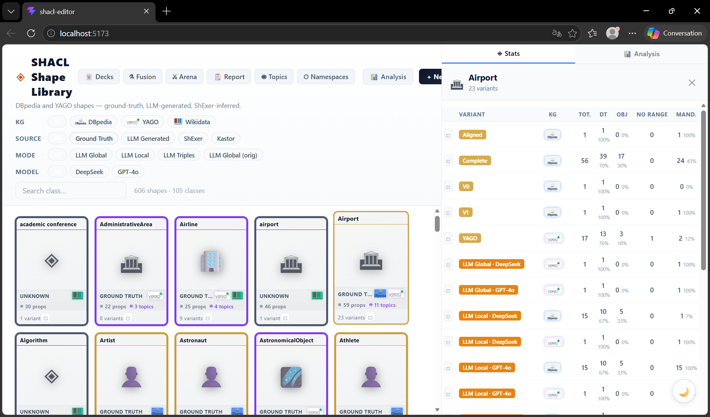

Clicking a card title or the **Stats** button on any card opens the **detail panel** on the right side of the screen. It shows all variants available for that class, sorted by knowledge graph and generation method.

Each row in the variant table displays:

| Column | Meaning |
|--------|---------|
| **VARIANT** | Short label (e.g., Ground Truth, LLM-Global-DeepSeek, LLM-Global-GPT-4o) |
| **KG** | Knowledge graph (DBpedia / YAGO) |
| **TOT** | Total number of property shapes |
| **DT** | Properties with a `sh:datatype` constraint |
| **OBJ** | Properties with a `sh:class` (object property) constraint |
| **NO RANGE** | Properties without any range constraint |
| **MAND** | Mandatory properties (`sh:minCount ≥ 1`) |

Click any variant row to load it directly into the **Shape Editor**.

---

### 1.3 Decks — curated shape collections

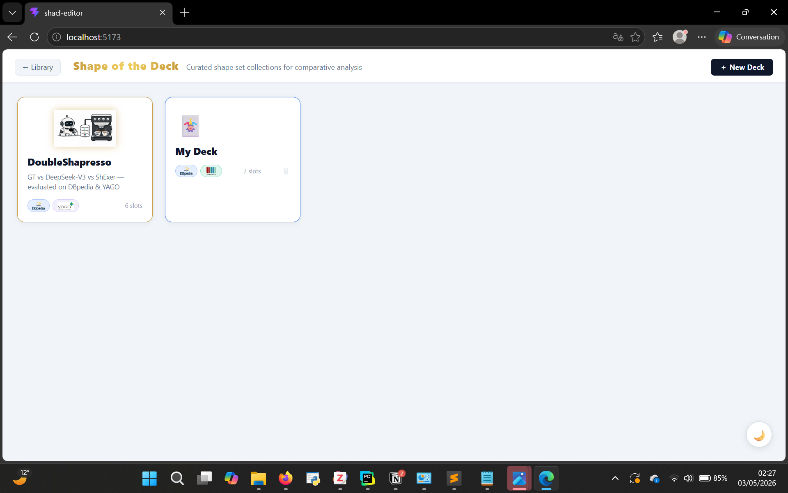

**Decks** are named collections of shape slots used for side-by-side comparative analysis. Navigate to them via the **Decks** button.

- Each deck card shows its name, a short description, the KGs covered (badge icons), and the number of *slots* (shape variants it holds).
- The pre-built **DoubleShapresso** deck compares Ground Truth vs DeepSeek-V3 vs ShExer across DBpedia and YAGO (6 slots).
- Click **+ New Deck** to create your own collection.
- Click a deck card to enter its comparison view.

---

## 2. Shape Editor — Graph View

Opening any shape from the library (or clicking **+ New**) switches to the **Shape Editor**. The top bar shows the breadcrumb path of the loaded shape and a full toolbar.

**Toolbar controls (left to right):**

- `← Library` — return to the library without losing the current shape.
- **Shape path** — breadcrumb showing the source file (e.g., `ground-truth/SHACL/dbpedia-complete/Airport`).
- `← Undo` / `↪ Redo` — multi-step history (also Ctrl+Z / Ctrl+Y).
- `Delete` — remove the selected node.
- **UML / VOWL** — toggle graph rendering style.
- **⬡ Graph / ☰ List / ⌨ Code** — switch the main view.
- `💾 .ttl` — download the current shape as a Turtle file.
- `📚 Library` — save the shape back into the local library.
- `→ ShEx` / `← ShEx` — export / import via the ShapeTranslator service.
- `⚙ Config` — open the prefix and ontology configuration panel.

---

### 2.1 UML and VOWL rendering modes

The **Graph view** offers two rendering styles selectable from the toolbar toggle:

**UML mode** (default)
Properties are displayed as rows inside a class table node. The NodeShape is the header; each PropertyShape is an inline row. Edges connect NodeShapes to each other for object-property links.

**VOWL mode**
Every PropertyShape becomes a standalone coloured hexagon node radiating outward from the central NodeShape. Edges are labelled with the `sh:path` value. This layout is better suited for visualising the overall connectivity of a shape.

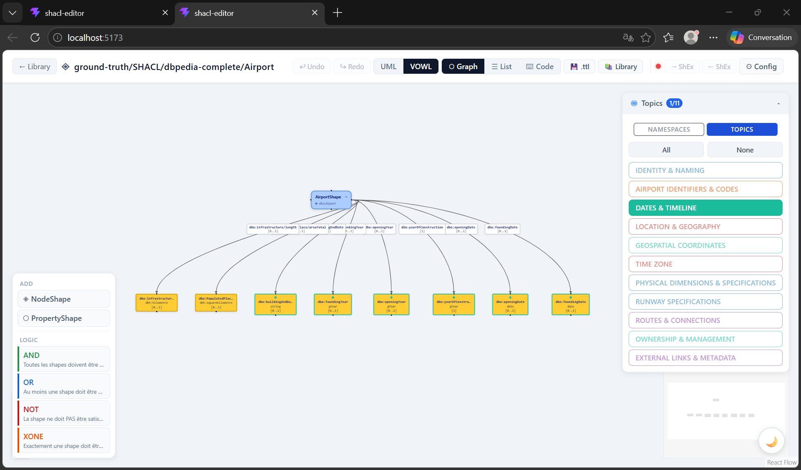

The VOWL screenshot above shows the **DBpedia Airport** shape with its full set of property nodes colour-coded by topic group.

---

### 2.2 Topic and namespace filters

Both graph modes include a **filter panel** (top-right corner, ◉ button) that lets you focus on a subset of properties.

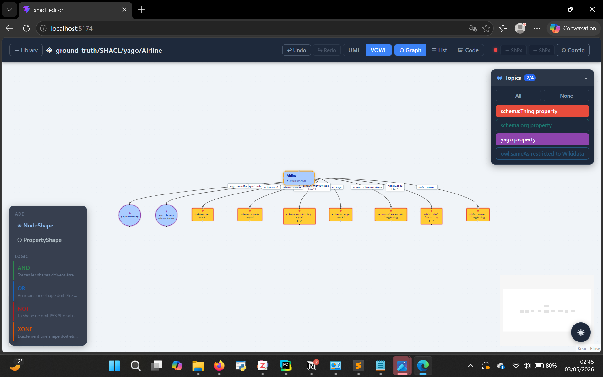

The filter panel has two **perspectives**:

**Namespaces** — groups properties by their `sh:path` prefix (e.g., `dbo:`, `schema:`, `yago:`). Each prefix gets a unique colour dot. Active namespaces are highlighted; inactive ones are hidden from the graph.

**Topics** — groups properties by their semantic annotation (the `# ═══ TOPIC NAME ═══` comment blocks in the Turtle source). Example topics for Airport:

- IDENTITY & NAMING
- DATES & TIMELINE
- LOCATION & GEOGRAPHY
- GEOSPATIAL COORDINATES
- TIME ZONE
- PHYSICAL DIMENSIONS & SPECIFICATIONS
- RUNWAY SPECIFICATIONS
- ROUTES & CONNECTIONS
- OWNERSHIP & MANAGEMENT
- EXTERNAL LINKS & METADATA

Use **All** / **None** buttons to toggle all topics at once, or click individual topic chips to show/hide specific groups. The count badge on the filter button (e.g., `3/10`) shows how many groups are currently visible.

> **Tip:** Topic annotations are embedded in the Turtle source as section-header comments. Only Ground Truth shapes carry full topic annotations; LLM-generated shapes may use namespace-derived groupings instead.

---

## 3. Shape Editor — List and Code Views

### 3.1 List view

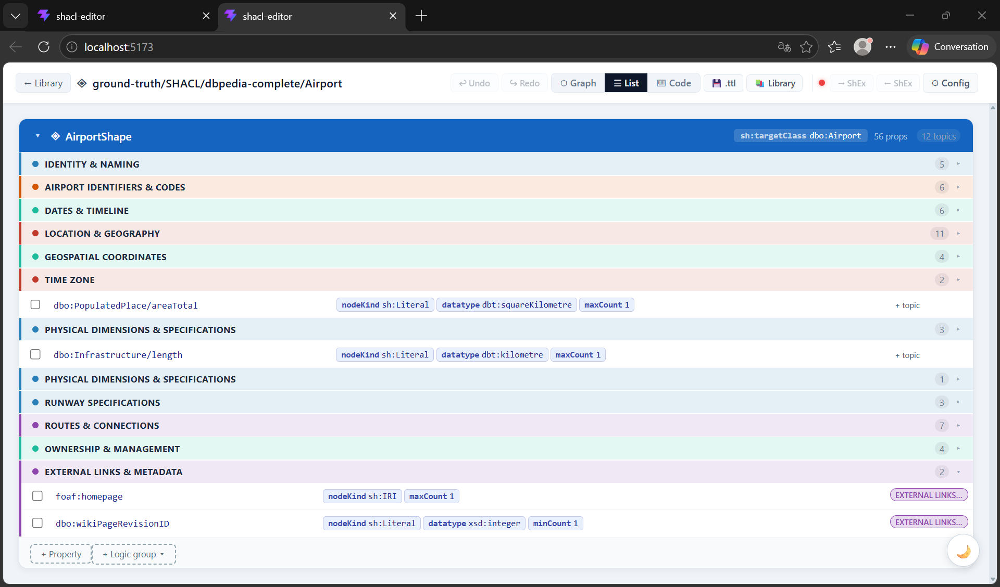

Switch to **☰ List** for a structured, spreadsheet-like breakdown of the shape.

The view opens with the **NodeShape header** (e.g., `AirportShape`) showing the `sh:targetClass` and aggregate counts (props, topics). Below it, properties are grouped under collapsible **topic sections** (same topic annotation as in the graph filter).

Each property row shows:

| Column | Content |
|--------|---------|
| **Path** | `sh:path` value (e.g., `dbo:populatedPlace/areafotal`) |
| **nodeKind** | `sh:Literal`, `sh:IRI`, or blank |
| **datatype** | `sh:datatype` value (e.g., `xsd:squareMetre`) |
| **maxCount** | `sh:maxCount` if set |
| **Tag** | `EXTERNAL LINK` or other semantic badges |

**Bottom toolbar:**
- `+ Property` — add a new PropertyShape connected to the selected NodeShape.
- `+ Logic group` — add a logic operator node (`sh:and`, `sh:or`, `sh:not`, `sh:xone`).

You can **assign topics** to individual properties via the inline topic chip on each row, or select multiple rows (checkboxes) to bulk-assign a topic using the sticky **Bulk Bar** that appears at the top of the list.

---

### 3.2 Code view

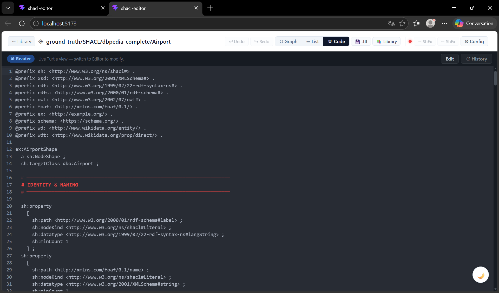

Switch to **⌨ Code** to read and edit the raw Turtle source directly. The editor is a live code panel with:

- **Syntax** — full Turtle with `@prefix` declarations, NodeShape definition, and `sh:property [...]` blocks.
- **Section comments** — `# ════ IDENTITY & NAMING ════` header lines annotate property groups. These are read by the Topic filter and List view.
- **Edit** button — unlock the editor for free-text editing. Apply your changes to update the graph model.
- **History** button — browse the edit history of the shape.

> The code view is useful for adding complex SHACL constraints not yet supported by the graph UI (e.g., `sh:sparql`, `sh:node`, complex `sh:path` expressions).

---

## 4. Topic Studio

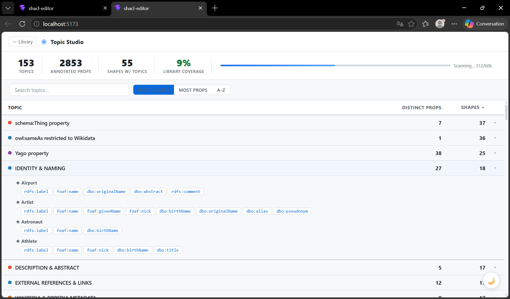

Navigate to **Topic Studio** from the library's `◉ Topics` button. It scans all 606 shapes in the library and builds a cross-shape index of every semantic topic annotation.

**Stats bar:**

| Metric | Meaning |
|--------|---------|
| **Topics** | Number of distinct topic labels found |
| **Annotated props** | Total count of (shape, path) pairs with a topic |
| **Shapes w/ topics** | How many shapes carry at least one topic annotation |
| **Library coverage** | Percentage of all library shapes that have topic annotations |

A live **progress bar** shows scanning progress (e.g., *Scanning… 312/606*).

**Table columns:**

- **Topic** — the annotation label with a colour dot.
- **Distinct props** — number of unique `sh:path` values tagged with this topic.
- **Shapes** — number of different shapes that use this topic.

**Sorting** — three buttons: `Most shapes` · `Most props` · `A–Z`.

**Search** — filter the table to topics matching a substring.

**Expandable rows** — click any row to expand it and see which shapes use that topic and which property paths they contribute. For example, expanding **IDENTITY & NAMING** reveals:

```
◈ Airport   → rdfs:label  foaf:name  dbo:originalName  dbo:abstract  rdfs:comment
◈ Artist    → rdfs:label  foaf:name  foaf:givenName  foaf:nick  dbo:birthName  …
◈ Astronaut → rdfs:label  foaf:name  dbo:birthName
◈ Athlete   → rdfs:label  foaf:name  foaf:nick  dbo:birthName  dbo:title
```

> **Use case:** Topic Studio is valuable for understanding cross-ontology modelling patterns, discovering which classes share semantic groups, and identifying property candidates when authoring a new shape.

---

## 5. Namespace Studio

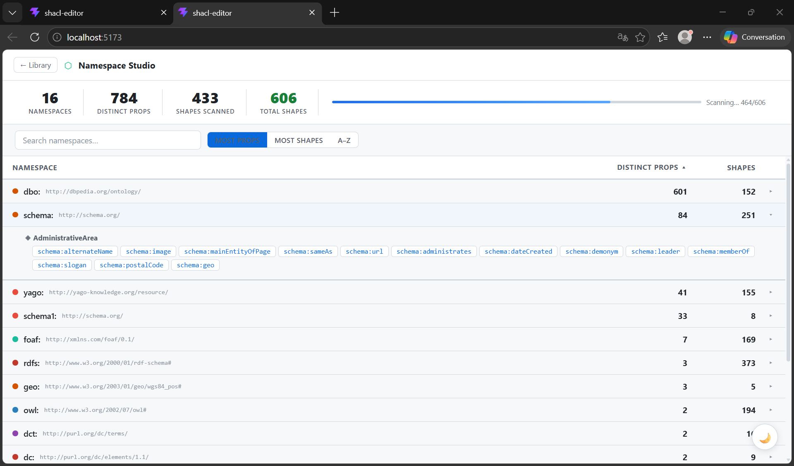

Navigate to **Namespace Studio** from the library's `⬡ Namespaces` button. It performs the same full-library scan as Topic Studio but indexed by **namespace prefix** instead of topic annotation.

**Stats bar:**

| Metric | Meaning |
|--------|---------|
| **Namespaces** | Number of distinct prefixes found across all shapes |
| **Distinct props** | Total unique `sh:path` values identified |
| **Shapes scanned** | Shapes processed so far |
| **Total shapes** | Total shapes in the library |

**Table columns:**

- **Namespace** — prefix label (e.g., `dbo:`) with its full URI (e.g., `http://dbpedia.org/ontology/`).
- **Distinct props** — number of unique property paths using this prefix.
- **Shapes** — number of shapes that use at least one path from this namespace.

Example data from a full scan:

| Namespace | URI | Props | Shapes |
|-----------|-----|-------|--------|
| `dbo:` | http://dbpedia.org/ontology/ | 601 | 152 |
| `schema:` | http://schema.org/ | 84 | 251 |
| `yago:` | http://yago-knowledge.org/resource/ | 41 | 155 |
| `foaf:` | http://xmlns.com/foaf/0.1/ | 7 | 169 |
| `rdfs:` | http://www.w3.org/2000/01/rdf-schema# | 3 | 373 |
| `owl:` | http://www.w3.org/2002/07/owl# | 2 | 194 |

**Expandable rows** — click any namespace row to see which shapes use it and which specific paths they contribute. For example, expanding `schema:` for *AdministrativeArea* reveals:

```
schema:alternateName  schema:image  schema:mainEntityOfPage  schema:sameAs
schema:url  schema:administrates  schema:dateCreated  schema:demonym
schema:leader  schema:memberOf  schema:slogan  schema:postalCode  schema:geo
```

**Search** — type a prefix name to filter the table instantly.

> **Use case:** Namespace Studio helps identify which ontologies dominate the library (DBpedia, Schema.org, YAGO), spot coverage gaps, and decide which prefixes to include when designing a new shape.

---

## 6. Shape Arena

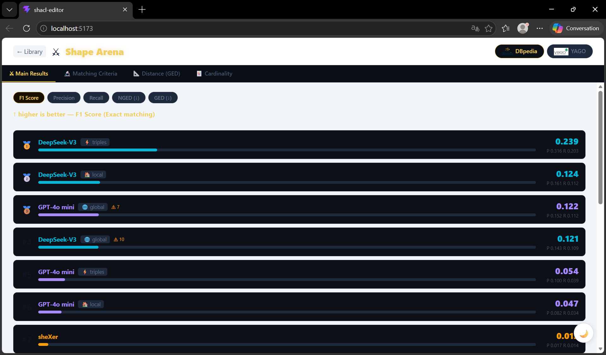

Navigate to **Shape Arena** from the library's `✕ Arena` button. The Arena is a **leaderboard** for evaluating and comparing shape generation methods against ground-truth shapes.

**KG selector** (top-right): toggle between **DBpedia** and **YAGO** to switch the evaluation dataset.

**Metric tabs:**

| Tab | Description |
|-----|-------------|
| **Main Results** | Overall quality scores |
| **Matching Criteria** | Breakdown of property matching rules |
| **Distance (GED)** | Graph Edit Distance analysis |
| **Cardinality** | Constraint tightness comparison |

**Metric buttons** — switch the ranking metric:

- **F1 Score** — harmonic mean of precision and recall (higher is better).
- **Precision** — fraction of generated properties that are correct.
- **Recall** — fraction of ground-truth properties that are recovered.
- **NGED (n)** — normalised Graph Edit Distance.
- **GED (n)** — raw Graph Edit Distance.

**Leaderboard rows** (example, DBpedia F1 Score):

| Rank | System | Mode | Score |
|------|--------|------|-------|
| 🥇 1 | DeepSeek-V3 | triples | **0.239** |
| 🥈 2 | DeepSeek-V3 | local | 0.124 |
| 🥉 3 | GPT-4o mini | global (△7) | 0.122 |
| 4 | DeepSeek-V3 | global (△10) | 0.121 |
| 5 | GPT-4o mini | triples | 0.054 |
| 6 | GPT-4o mini | local | 0.047 |
| 7 | sheXer | — | 0.01… |

A horizontal bar provides a visual proportion of the score. The annotation `P 0.316 R 0.203` shows Precision and Recall alongside the F1.

> **Use case:** Use the Arena to select the best-performing variant for a given class and KG before loading it into the editor for further refinement.

---

## 7. Shape Report

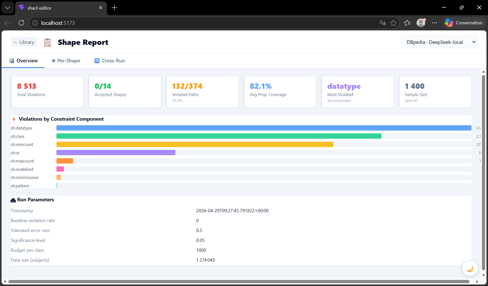

Navigate to **Shape Report** from the library's `Report` button. The report viewer shows the results of running SHACL validation against a sampled subset of a KG.

**Run selector** (top-right drop-down) — choose the run to inspect (e.g., *DBpedia · DeepSeek-local*).

**Three tabs:**

| Tab | Content |
|-----|---------|
| **Overview** | Aggregate statistics and violation breakdown |
| **Per-Shape** | Shape-by-shape accepted/violated status |
| **Cross-Run** | Side-by-side comparison across runs |

### Overview tab

**Summary cards:**

| Card | Value (example) | Meaning |
|------|-----------------|---------|
| Total Violations | 8 513 | All SHACL constraint violations found |
| Accepted Shapes | 0 / 14 | Shapes with violation rate below tolerance |
| Violated Paths | 132 / 374 (35.3%) | Property paths that triggered at least one violation |
| Avg Prop. Coverage | 82.1% | Average fraction of shape properties matched in the data |
| Most Violated | `datatype` | Constraint component causing most violations |
| Sample Size | 1 400 (seed 42) | Number of subjects sampled per class |

**Violations by Constraint Component** — horizontal bar chart showing which SHACL constraint types produced the most violations:

1. `sh:datatype` (most violations)
2. `sh:class`
3. `sh:minCount`
4. `sh:or`
5. `sh:maxCount`
6. `sh:nodeKind`
7. `sh:minInclusive`
8. `sh:pattern`

**Run Parameters** — meta-information about the evaluation run:

| Parameter | Value |
|-----------|-------|
| Timestamp | 2026-04-29T09:27:45 |
| Baseline violation rate | 0 |
| Tolerated error rate | 0.5 |
| Significance level | 0.05 |
| Budget per class | 1 000 |
| Data size (subjects) | 1 374 049 |

> **Use case:** Use the Report to identify which constraints are too strict (many violations) vs well-calibrated, and to decide which property blocks to relax or remove before deploying a shape in a production validation pipeline.

---

## 8. Configuration

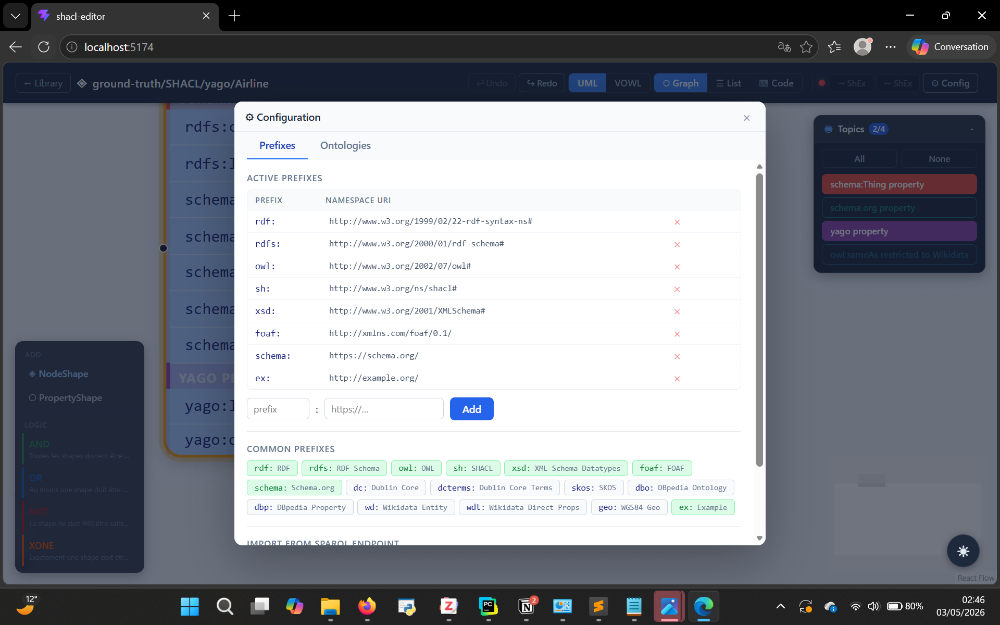

Open the **⚙ Config** panel from the Shape Editor toolbar at any time. It manages the namespace prefixes and external ontologies available to the editor.

### Prefixes tab

**Active Prefixes** — the prefixes currently declared in the shape. Each row shows the short prefix and its full namespace URI, with an × button to remove it.

Example active prefixes:

| Prefix | Namespace URI |
|--------|--------------|
| `rdf:` | http://www.w3.org/1999/02/22-rdf-syntax-ns# |
| `rdfs:` | http://www.w3.org/2000/01/rdf-schema# |
| `owl:` | http://www.w3.org/2002/07/owl# |
| `xsd:` | http://www.w3.org/2001/XMLSchema# |
| `sh:` | http://www.w3.org/ns/shacl# |
| `foaf:` | http://xmlns.com/foaf/0.1/ |
| `schema:` | https://schema.org/ |
| `ex:` | http://example.org/ |

**Add a custom prefix** — type the short prefix and full URI into the input fields at the bottom and click **Add**.

**Common Prefixes** — a palette of quick-add buttons for frequently used vocabularies:

`rdf:` · `rdfs:` · `owl:` · `xsd:` · `sh:` · `Schema` · `foaf` · `dc` · `dbo` · `dct` · `terms` · `skos` · `geo:` · `WGS84 Geo Prop` · `wdt:` · `Example`

Click any button to instantly add that prefix to the active list.

**Import prefix from SPARQL endpoint** — enter a SPARQL endpoint URL to automatically extract all `@prefix` declarations it uses and import them into the active list.

### Ontologies tab

The second tab allows registering external ontologies. Once registered, the editor can offer property-path auto-completion and constraint suggestions drawn from those ontologies.

---

## Quick-Start Workflow

```
1. Open the Shape Library.
2. Use the KG / Source / Model filters to narrow your selection.
3. Click a shape card → open the Stats panel to compare variants.
4. Click the best-scoring variant row to load it into the Shape Editor.
5. Switch between Graph (UML/VOWL), List, and Code views as needed.
6. Use the Topics filter panel to focus on a semantic group.
7. Edit properties in List view or directly in Code view.
8. Click 💾 .ttl to download, or 📚 Library to save back to the library.
9. Visit Topic Studio and Namespace Studio to explore the library corpus.
10. Use the Arena to benchmark generation methods; use the Report to validate.
```

---

*Tutorial generated from the Shapespresso SHACL Editor — localhost:5173*
